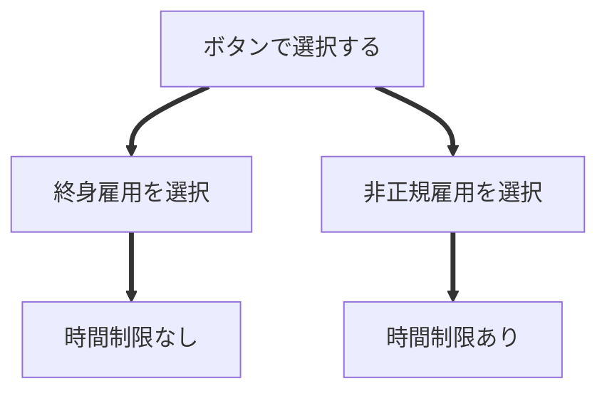

# BrightFuture

## ゲーム概要
政治家になり国民から税金を搾取するシミュレーションゲームです。
 
タップだけで遊べるゲームです。
 
「さく」というテーマを元にのゲームジャムイベントにて制作しました。
 
イベント内の投票の結果、12チーム中プレゼン、ゲーム内容の両ジャンルとも3位を獲得しました。

||内容|
|--|--|
|**言語**　　|c#|
|**開発環境**|2022.3.22f1|
|**開発期間**|2025/4/8～2025/4/10|
|**制作時間**|3日|
|**制作人数**|4人|

 

[作品動画説明](https://youtu.be/A03Nol5yV3g "作品説明へ")

 

>## 操作方法
### タイトル画面

### ゲーム画面
4つの選択肢が出現します。その中から1つの選択肢を選んでいきます。

 

>## ゲームについて
### ゲームオーバー条件
|終身雇用を選択|非正規雇用を選択|
|--|--|
|ゲージがマックスになった場合|時間が0になるか、ゲージがマックスになった場合|

#### なぜ終身雇用、非正規雇用なのか
終身雇用は、企業が従業員を定年まで**雇用し続けること**なので時間制限はなしとしました。
 
非正規雇用は、**雇用期間に定め**があったりするので時間制限あり、という考え方で設定しました。

### 内容
&emsp;4つの選択肢が出現しそれぞれ入手できる額や国民の怒る度合いが違います。それらの一つを選択し、
最終的にどれだけお金（スコア）を手に入れられるかがこのゲームの内容です。

&emsp;怒りゲージを減らすためには四つの選択肢の中に現れる**政策**を選択することで、
国民の反感を抑える=ゲージを減らすことが出来ます。
 
しかし、**政策**を選択すると集めてきた税金を使うので度合いに応じたお金ゲージ（スコア）が減るというデメリットがあります。

&emsp;上記のように国民を苦しめつつ、国民をコントロールし、税金をどれだけ徴収することが出来るかが
このゲームの内容となっております。

### 選択肢について
下記の4つの上からの順番にもらえる金額が高い順になっています。また、
%の度合いで金額が変わってきます。

### アピールポイント
- ボタンごとにスコア、モードの判定クラス作成
- スコアや残り時間
- シーン遷移と遷移時のフェード処理
- 全体結合
 
など